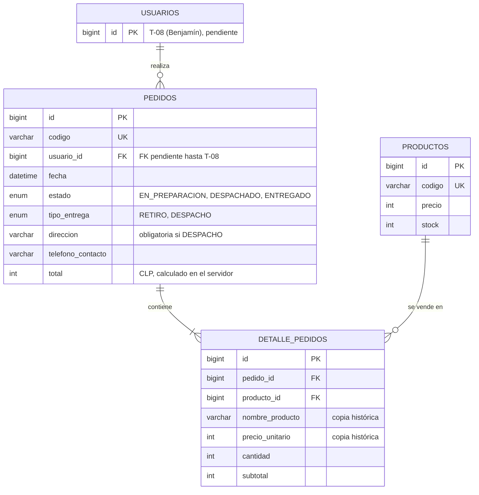

# Diagrama ER - Pedidos (T-04)

```mermaid
erDiagram
    USUARIOS ||--o{ PEDIDOS : realiza
    PEDIDOS ||--|{ DETALLE_PEDIDOS : contiene
    PRODUCTOS ||--o{ DETALLE_PEDIDOS : "se vende en"

    USUARIOS {
        bigint id PK "T-08 (Benjamín), pendiente"
    }
    PEDIDOS {
        bigint id PK
        varchar codigo UK
        bigint usuario_id FK "FK pendiente hasta T-08"
        datetime fecha
        enum estado "EN_PREPARACION, DESPACHADO, ENTREGADO"
        enum tipo_entrega "RETIRO, DESPACHO"
        varchar direccion "obligatoria si DESPACHO"
        varchar telefono_contacto
        int total "CLP, calculado en el servidor"
    }
    DETALLE_PEDIDOS {
        bigint id PK
        bigint pedido_id FK
        bigint producto_id FK
        varchar nombre_producto "copia histórica"
        int precio_unitario "copia histórica"
        int cantidad
        int subtotal
    }
    PRODUCTOS {
        bigint id PK
        varchar codigo UK
        int precio
        int stock
    }
```